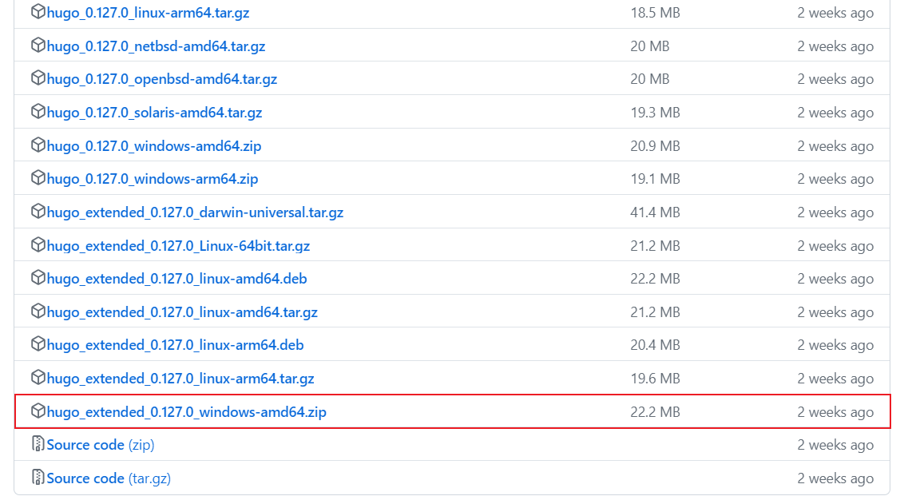
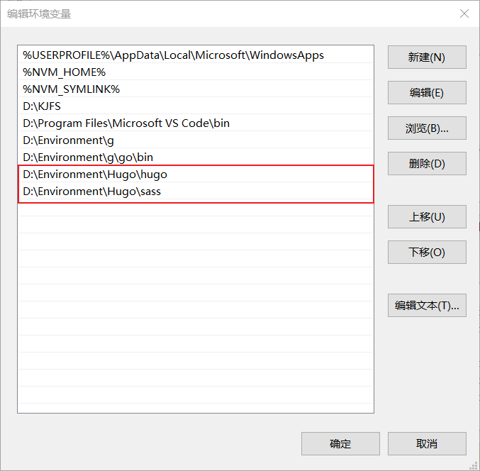
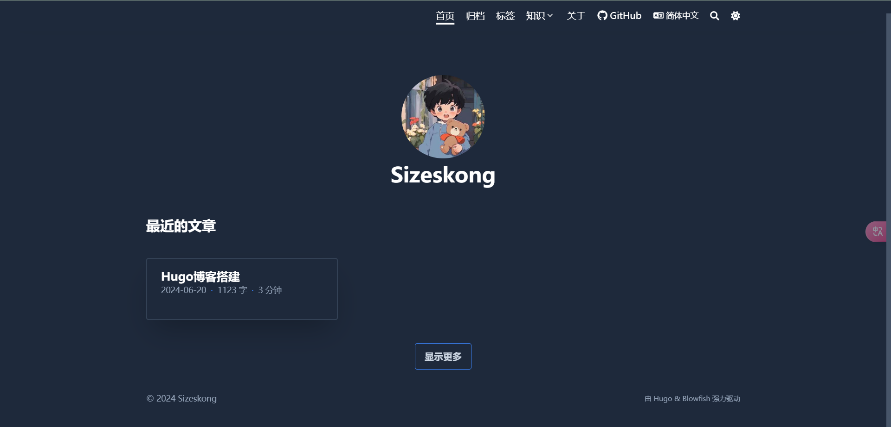
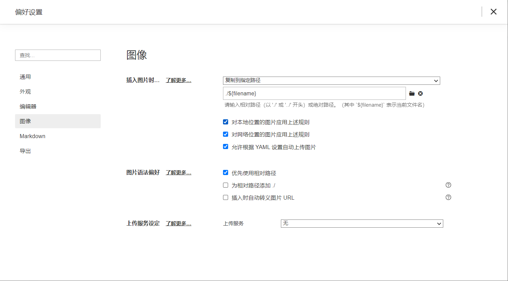
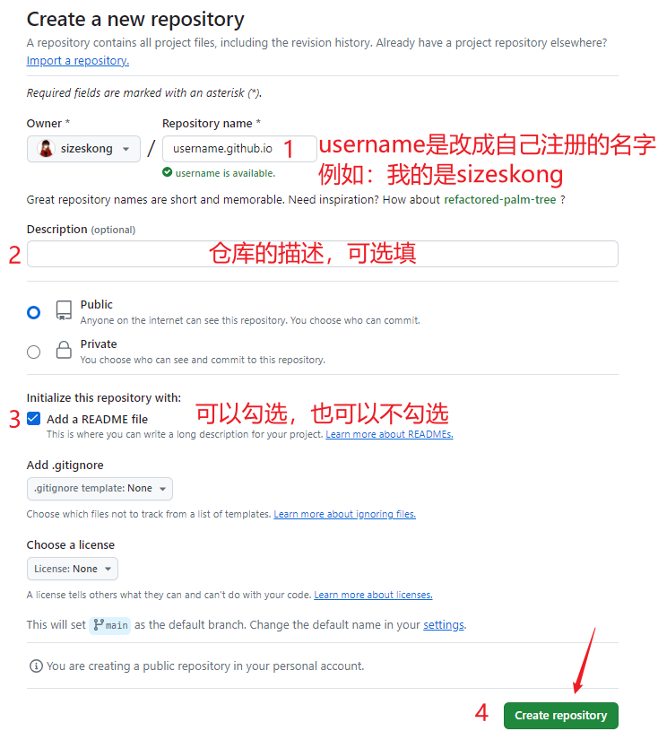
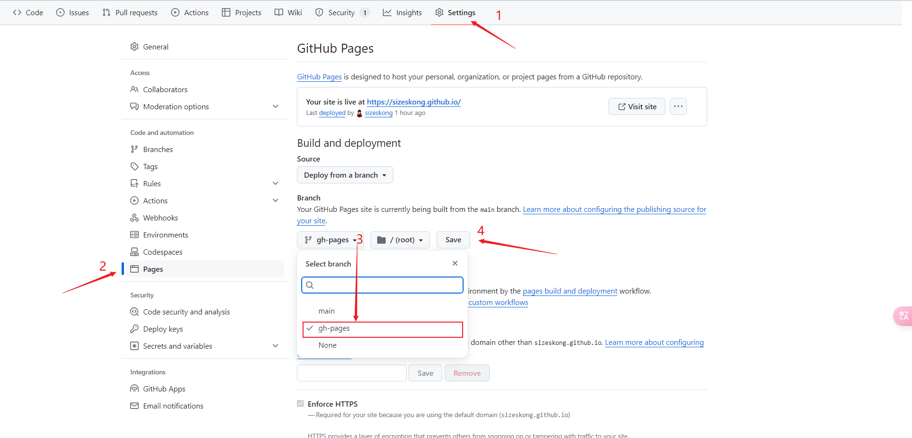
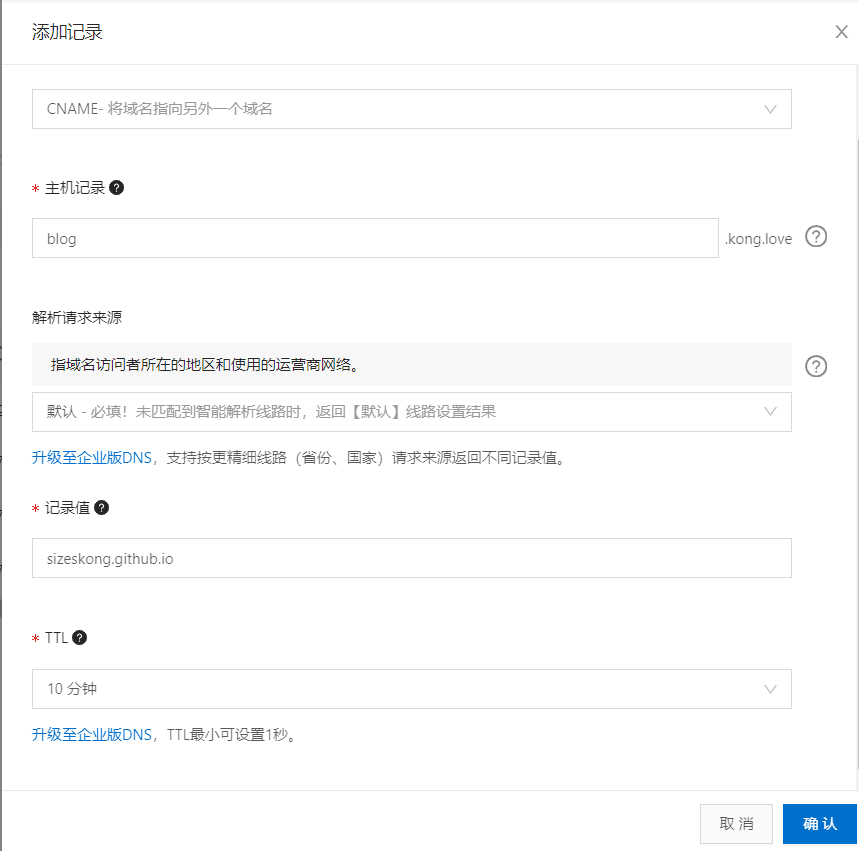
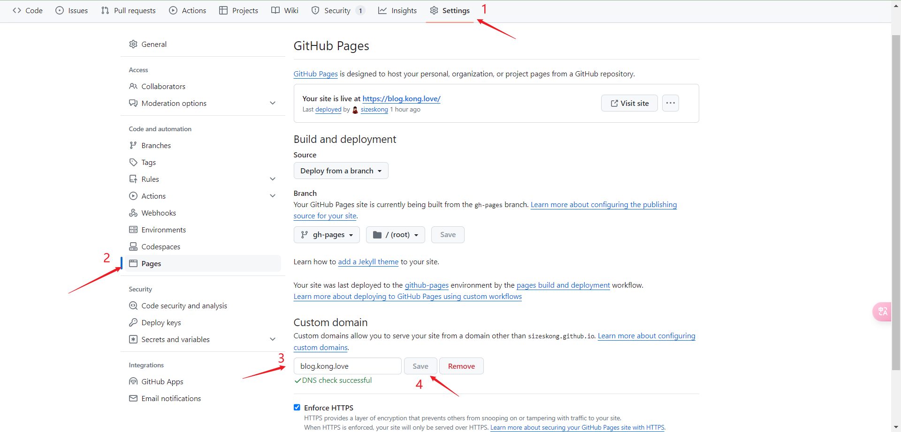
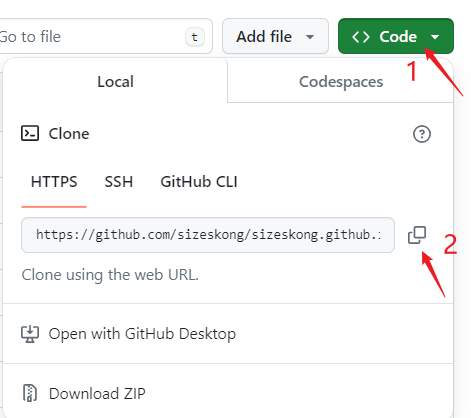
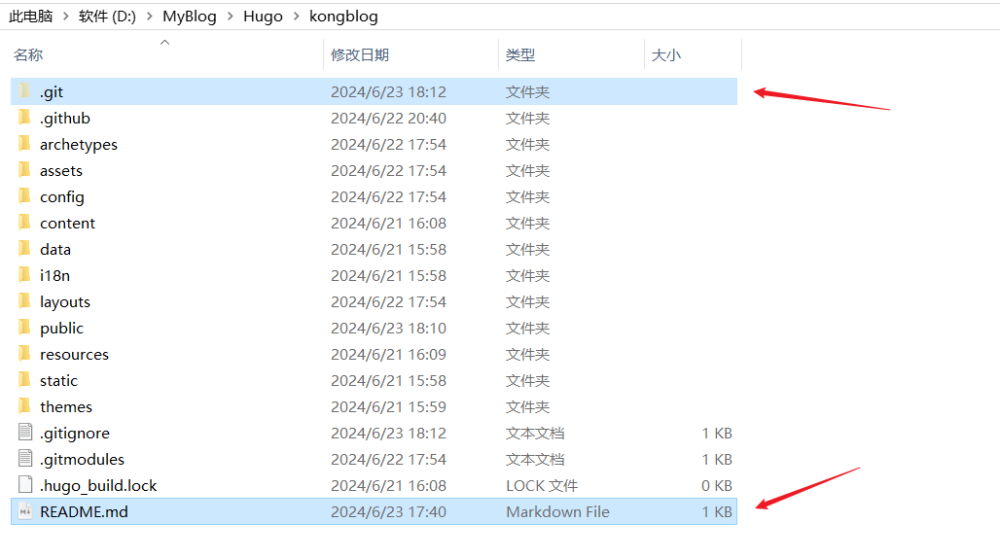

+++
title = 'Hugo博客搭建'
date = 2024-06-20T22:53:12+08:00
draft = false
tags = ["hugo"]

+++


## Hugo官网

**官网地址**：[https://gohugo.io/](https://gohugo.io/)

**中文地址**：[https://www.gohugo.org/doc/](https://www.gohugo.org/doc/)

## Windows 手动安装 Hugo

**Git** 下载地址：[https://git-scm.com/downloads](https://git-scm.com/downloads)

**Go** 下载地址：[https://golang.google.cn/dl/](https://golang.google.cn/dl/)

**Hugo** 下载地址：[https://github.com/gohugoio/hugo/releases](https://github.com/gohugoio/hugo/releases)



**Dart Sass** 下载：[https://github.com/sass/dart-sass/releases/](https://github.com/sass/dart-sass/releases/)


下载完解压到自己指定的目录，然后配置到环境变量中。**注意：解压后的文件名字可以随便改。**

例如：我解压到 `D:\Environment\Hugo` 目录下 有 `hugo` 和 `sass` 两个文件


## 配置环境变量

此电脑——右击属性——高级系统设置——环境变量——双击Path——新建——添加刚才的两个目录

**注意：我这里选择的是用户变量，也可以选择系统变量！**

例如：`D:\Environment\Hugo\hugo` 和 `D:\Environment\Hugo\sass`




## 检测是否安装成功

```toml
# 查看当前版本
hugo version
# 查看环境
hugo env
```


到此安装成功！


## 创建自己的博客项目

```toml
# 创建项目文件
hugo new Site KongBlog
# 进入项目目录
cd KongBlog
# 初始化 git 仓库
git init
# 安装主题
git submodule add -b main https://github.com/nunocoracao/blowfish.git themes/blowfish

# 注意：主题下载完后，删除项目根目录下生成的 hugo.toml 文件，把主题中的 config 文件 拷贝到项目根目录下
# 项目根目录：KongBlog
# 主题的目录：KongBlog\themes\blowfish\config
## 注意：这里要去项目根目录下的 config\_default\hugo.toml 文件中 设置主题配置，去掉注释即可。
# 设置主题
theme = 'Blowfish'

# 创建文章内容
# hugo new 一级目录/文章标题/index.md
# 注意：markdown文件必须以index命名
# 目的：让图片资源与文章内容在同一目录下，方便管理！
hugo new posts/Hugo博客搭建/index.md

# 打开 content\posts\Hugo博客搭建\index.md 文件，把 draft = true 改成 false 启动后就可以看到文章
# draft = true 是草稿的意思，不会显示。
# draft = false 是发布的意思，会显示。

# 生成静态资源 public 目录（网页显示的内容）
hugo

# 启动
hugo server

```


## 设置主题的配置文件

**Blowfish 主题官网文档**：[https://blowfish.page/zh-cn/docs/](https://blowfish.page/zh-cn/docs/)

主题下载完后，删除项目根目录下自动生成的 hugo.toml 文件，把主题中的 config 文件 拷贝到项目根目录下。

主题目录：`themes\blowfish\config`

项目根目录：`KongBlog`

一旦你复制了这些文件，你的 config 目录看起来应该是这样：

```toml
config/_default/
├─ hugo.toml
├─ languages.en.toml
├─ markup.toml  # 不需要配置
├─ menus.en.toml
├─ module.toml  # 不需要配置
└─ params.toml

```

**注意：在 hugo.toml 中，打开 theme = "blowfish" 注释，即可使用主题。**

如果想要以下这个效果，可以把下面的配置信息复制到自己的配置文件中！

如果不想使用如下效果，可以参考主题官网进行配置！

## 我的主题效果展示



## 我的配置文件信息

中英文切换，需要创建两个文件，一个中文的 `index.md` ，一个英文的 `index.en.md`。

中英文文件目录：content\posts\文章标题\index.md 和 index.en.md

如果不想显示中英文切换，只默认以中文显示，把英文配置文件删掉即可。

### hugo.toml 配置

```toml
# -- Site Configuration --
# Refer to the theme docs for more details about each of these parameters.
# https://blowfish.page/docs/getting-started/


# 主题
theme = "blowfish"

# 访问地址(改成自己的地址)
baseURL = "http://localhost:1313/"

# 默认内容语言
defaultContentLanguage = "zh-cn"

# 开启的字数和阅读时间
hasCJKLanguage = true

# pluralizeListTitles = "true" # hugo function useful for non-english languages, find out more in  https://gohugo.io/getting-started/configuration/#pluralizelisttitles

enableRobotsTXT = true
paginate = 10
summaryLength = 0

buildDrafts = false
buildFuture = false

enableEmoji = true

# googleAnalytics = "G-XXXXXXXXX"

[imaging]
  anchor = 'Center'

[taxonomies]
  tag = "tags"
  category = "categories"
  author = "authors"
  series = "series"

[sitemap]
  changefreq = 'daily'
  filename = 'sitemap.xml'
  priority = 0.5

[outputs]
  home = ["HTML", "RSS", "JSON"]

[related]
  threshold = 0
  toLower = false

    [[related.indices]]
        name = "tags"
        weight = 100

    [[related.indices]]
        name = "categories"
        weight = 100

    [[related.indices]]
        name = "series"
        weight = 50

    [[related.indices]]
        name = "authors"
        weight = 20

    [[related.indices]]
        name = "date"
        weight = 10

    [[related.indices]]
      applyFilter = false
      name = 'fragmentrefs'
      type = 'fragments'
      weight = 10

```


### languages.en.toml 配置

```toml
languageCode = "en"
languageName = "English"
weight = 2

# 网页标题
title = "Sizeskong Blog"

[params]
  displayName = "English"
  isoCode = "en"
  rtl = false
  dateFormat = "2 January 2006"
  # logo = "img/logo.png"
  # secondaryLogo = "img/secondary-logo.png"
  # description = "My awesome website"
  # copyright = "Copy, _right?_ :thinking_face:"

# 作者信息
[author]
  name = "Sizeskong"
  image = "img/avatar.jpg"
  #headline = "一个强大、轻量级的 Hugo 主题。"
  #bio = "一个强大、轻量级的 Hugo 主题。"
  #links = [
  #  { x-twitter = "https://twitter.com/burufugu" },
  #  { github = "https://github.com/sizeskong" },
  #]
```


### languages.zh-cn.toml 配置

```toml
# 语言代码
languageCode = "zh-cn"
# 语言的名称
languageName = "简体中文"
# 语言权重顺序
weight = 1

# 网页标题
title = "Sizeskong Blog"

# 语言在网站中的展示名
[params]
  displayName = "简体中文"
  isoCode = "zh-cn"
  rtl = false
  dateFormat = "2006-01-02"
  # logo = "img/logo.png"
  # secondaryLogo = "img/secondary-logo.png"
  # description = "My awesome website"
  # copyright = "Copy, _right?_ :thinking_face:"

# 作者信息
[author]
  name = "Sizeskong"
  image = "img/avatar.jpg"
  #headline = "一个强大、轻量级的 Hugo 主题。"
  #bio = "一个强大、轻量级的 Hugo 主题。"
  #links = [
  #  { x-twitter = "https://twitter.com/burufugu" },
  #  { github = "https://github.com/sizeskong" },
  #]

```


### menus.en.toml 配置

```toml
# -- Main Menu --
# The main menu is displayed in the header at the top of the page.
# Acceptable parameters are name, pageRef, page, url, title, weight.
# 
# The simplest menu configuration is to provide:
#   name = The name to be displayed for this menu link
#   pageRef = The identifier of the page or section to link to
#
# By default the menu is ordered alphabetically. This can be
# overridden by providing a weight value. The menu will then be
# ordered by weight from lowest to highest.

[[main]]
  name = "Home"
  # pre = "bars"
  pageRef = "/"
  weight = 10


[[main]]
  name = "Archives"
  pageRef = "/posts"
  weight = 20

[[main]]
  name = "Tags"
  pageRef = "tags"
  weight = 30

# 主菜单
[[main]]
  name = "StudyNotes"
  pageRef = "studyNotes"
  weight = 40 

# 子菜单
[[main]]
  name = "Go"
  parent = "StudyNotes"
  pageRef = "Go"
  weight = 10

[[main]]
  name = "MySQL"
  parent = "StudyNotes"
  pageRef = "MySQL"
  weight = 20

[[main]]
  name = "About"
  pageRef = "about"
  weight = 50

[[main]]
  pre = "github"
  name = "GitHub"
  url = "https://github.com/sizeskong"
  weight = 70


#[[main]]
#  name = "example sub-menu 1"
#  parent = "Parent"
#  pageRef = "posts"
#  weight = 20

#[[main]]
#  name = "example sub-menu 2"
#  parent = "Parent"
#  pageRef = "posts"
#  weight = 20

#[[subnavigation]]
#  name = "An interesting topic"
#  pageRef = "tags/interesting-topic"
#  weight = 10

#[[subnavigation]]
#  name = "My Awesome Category"
#  pre = "github"
#  pageRef = "categories/awesome"
#  weight = 20

#[[main]]
#  name = "Categories"
#  pageRef = "categories"
#  weight = 20

#[[main]]
#  name = "Tags"
#  pageRef = "tags"
#  weight = 30


# -- Footer Menu --
# The footer menu is displayed at the bottom of the page, just before
# the copyright notice. Configure as per the main menu above.


# [[footer]]
#   name = "Tags"
#   pageRef = "tags"
#   weight = 10

# [[footer]]
#   name = "Categories"
#   pageRef = "categories"
#   weight = 20

```


### menus.zh-cn.toml 配置

```toml
# -- Main Menu --
# The main menu is displayed in the header at the top of the page.
# Acceptable parameters are name, pageRef, page, url, title, weight.
# 
# The simplest menu configuration is to provide:
#   name = The name to be displayed for this menu link
#   pageRef = The identifier of the page or section to link to
#
# By default the menu is ordered alphabetically. This can be
# overridden by providing a weight value. The menu will then be
# ordered by weight from lowest to highest.

[[main]]
  name = "首页"
  # pre = "bars"
  pageRef = "/"
  weight = 10

[[main]]
  name = "归档"
  pageRef = "posts"
  weight = 20

[[main]]
  name = "标签"
  pageRef = "tags"
  weight = 30

# 主菜单
[[main]]
  name = "知识"
  pageRef = "studyNotes"
  weight = 40 

# 子菜单
[[main]]
  name = "Go知识"
  parent = "知识"
  pageRef = "Go"
  weight = 10

[[main]]
  name = "MySQL知识"
  parent = "知识"
  pageRef = "MySQL"
  weight = 20

[[main]]
  name = "关于"
  pageRef = "about"
  weight = 50

[[main]]
  pre = "github"
  name = "GitHub"
  url = "https://github.com/sizeskong"
  weight = 70


#[[main]]
#  name = "example sub-menu 1"
#  parent = "Parent"
#  pageRef = "posts"
#  weight = 20

#[[main]]
#  name = "example sub-menu 2"
#  parent = "Parent"
#  pageRef = "posts"
#  weight = 20

#[[subnavigation]]
#  name = "An interesting topic"
#  pageRef = "tags/interesting-topic"
#  weight = 10

#[[subnavigation]]
#  name = "My Awesome Category"
#  pre = "github"
#  pageRef = "categories/awesome"
#  weight = 20

#[[main]]
#  name = "Categories"
#  pageRef = "categories"
#  weight = 20

#[[main]]
#  name = "Tags"
#  pageRef = "tags"
#  weight = 30


# -- Footer Menu --
# The footer menu is displayed at the bottom of the page, just before
# the copyright notice. Configure as per the main menu above.


# [[footer]]
#   name = "Tags"
#   pageRef = "tags"
#   weight = 10

# [[footer]]
#   name = "Categories"
#   pageRef = "categories"
#   weight = 20

```


### params.toml 配置

```toml
# -- Theme Options --
# These options control how the theme functions and allow you to
# customise the display of your website.
#
# Refer to the theme docs for more details about each of these parameters.
# https://blowfish.page/docs/configuration/#theme-parameters

# 主题使用的颜色
colorScheme = "blowfish"

# 默认的主题外观，可以是 light 或者 dark
defaultAppearance = "light" # valid options: light or dark

# 主题外观是否根据访问者操作系统的偏好自动切换。设置为 false 会强制网站始终使用 defaultAppearance
autoSwitchAppearance = true

# 是否开启网站的搜索功能，设为 true 即为启用
enableSearch = true

# 是否可以将<code>代码块复制到剪贴板
enableCodeCopy = true

# 指定最近文章中应该展示的模块。 如果没有指定，则使用文章数量最多的板块。
# mainSections = ["section1", "section2"]
# 用于支持搜索引擎爬虫如何处理你的网站。
# robots = ""

# 禁用图片上所有图片的调整大小和优化功能。
disableImageOptimization = false

# 禁用文本类型的标题，对基于 logo 的标题很有用。
disableTextInHeader = true

# 设置默认背景图，用于 background 和 hero 布局下的主页
# defaultBackgroundImage = "image.jpg" # 默认用于背景图像 

# 设置默认背景图片，用于所有文章的featured图片，可以通过文章目录中的 featured 图片替换。
# defaultFeaturedImage = "IMAGE.jpg" # used as default for featured images in all articles

# 当菜单被选择时，标记主菜单中的菜单项。
highlightCurrentMenuArea = true

# 开启智能目录，视图中的项目将会被高亮显示。
# smartTOC = true

# 当开启智能目录，如果目录级别不再被聚焦时，将会隐藏更深层次的目录。
# smartTOCHideUnfocusedChildren = true

[header]
  layout = "fixed" # valid options: basic, fixed, fixed-fill, fixed-gradient, fixed-fill-blur


# 页脚
[footer]
  showMenu = true # 显示/隐藏页面底部菜单
  showCopyright = true # 是否在底部显示 copyright 版权信息
  showThemeAttribution = true # 是否在网站底部中显示"powered by" 的主题归属信息
  showAppearanceSwitcher = true # 是否在也页面底部显示外观切换器
  showScrollToTop = true # 当设置为 true 时，显示返回顶部的箭头按钮

# 主页
[homepage]
  layout = "profile" # valid options: page, profile, hero, card, background, custom 有效选项：页面、简介、英雄、卡片、背景、自定义
  # homepageImage = "image.jpg" # 在 hero 和 card 布局中使用的图像
  showRecent = true # 是否在主页展示最新文章列表。
  showRecentItems = 6 # 如果将 showRecent 设置为 true，此参数用于显示多少篇文章。如果没有设置或者为0，则默认显示5篇文章
  showMoreLink = true # 是否在主页底部添加“显示更多”，该链接会降会用带到一个预定义位置。
  showMoreLinkDest = "/posts" # 更多按钮所指向的位置。
  cardView = true # 将列表展示为卡片容器。
  cardViewScreenWidth = false # 增强列表中卡片的宽度，使其可以占据可用的全部宽度。
  layoutBackgroundBlur = true # 向下滚动主页时，是否模糊背景图。

# 文章页
[article]
  # 是否显示日期。
  showDate = true 

  # 缩略图是否会在每个页面中作为 hero 图像显示。
  showHero = false 

  # hero 图像的展示样式，可选的参数值有：basic、big、background、thumbAndBackground
  heroStyle = "background" 

  # 是否展示文章的更新日期。
  showDateUpdated = false 

  # 是否在文章底部显示作者框。
  showAuthor = false 

  # 作者框显示在每页的底部而不是顶部。
  showAuthorBottom = false 

  # 向下滚动文章页时，是否模糊背景图。
  layoutBackgroundBlur = true 

  # 在标题和正文之间添加空白区域间隔。
  layoutBackgroundHeaderSpace = true 

   # 是否在标题栏显示面包屑导航。
  showBreadcrumbs = false

  # 当使用 --buildDrafts 构建网站时，是否在文章旁边显示草稿
  showDraftLabel = true 

  # 是否展示编辑文章的链接。
  showEdit = false 

  # 是否默认显示打开系列模块、
  seriesOpened = false 

  # 是否在文章标题旁添加锚点。
  showHeadingAnchors = true 

  # 是否在文章末尾展示上一篇/下一篇的文章链接。
  showPagination = true

  # 是否翻转下一篇/上一篇文章链接的方向。
  invertPagination = false 

  # 是否展示文章的阅读时间。如果你的语言包含 CJK 语言，需要在 config.toml 中开启 hasCJKLanguage 参数。
  showReadingTime = true 

  # 是否显示文章的字数。 如果你的语言属于 CJK 语言，需要在 hugo.toml 中开启 hasCJKLanguage 参数。
  showWordCount = true 

  # 是否展示文章的目录。
  showTableOfContents = true

  # 为文章显示相关内容。
  showRelatedContent = false 

  # 如果启用showRelatedContent，则限制显示相关文章的数量
  relatedContentLimit = 3 

  # 是否显示文章的分类或标签信息。
  showTaxonomies = false 

  # 否在文章或列表中显示 authors 分类。这需要开启多个作者 multiple authors 和 authors 分类法。 
  showAuthorsBadges = false 

  # 是否在文章末尾添加 评论部分
  showComments = true 

  # 在文章末尾显示的分享链接。如果没有提供或设置为 false，则不会显示任何分享链接。可用的值包括：“linkedin”、“twitter”、“reddit”、“pinterest”、“facebook”、“email”、“whatsapp” 和 “telegram”
  # sharingLinks = [ "linkedin", "twitter", "reddit", "pinterest", "facebook", "email", "whatsapp", "telegram"]
  
  # 指定是否激活文章阅读的禅模式，即隐藏常规的界面元素。
  showZenMode = true 


[list]
  # 缩略图是否会在每个页面中作为 hero 图像显示。
  showHero = false

  # hero 图像的展示样式，可选的参数值有：basic、big、background、thumbAndBackground。
  # heroStyle = "background" 

  # 是否在标题栏显示面包屑导航。
  showBreadcrumbs = false

  # 向下滚动列表页时，是否模糊背景图。
  layoutBackgroundBlur = true # only used when heroStyle equals background or thumbAndBackground

  # 在标题和正文之间添加空白区域间隔。
  layoutBackgroundHeaderSpace = true # only used when heroStyle equals background  

  # 是否展示目录。
  showTableOfContents = false

  # 是否在列表页显示文章摘要。如果在扉页参数中没有提供摘要，那么将会使用站点配置 中的 summaryLength 参数自动生成一个。
  showSummary = false

  # 是否显示文章阅读量。
  showViews = false

  # 是否显示文章点赞量。
  showLikes = false

  # 是否将每个文章显示未卡片或简单的内联文本。
  showCards = false

  # 是否根据年做聚合。
  groupByYear = true

  # 将列表展示为卡片容器。
  cardView = false

  # 增强列表中卡片的宽度，使其可以占据可用的全部宽度。
  cardViewScreenWidth = false

  # 将项目宽度限制为 prose 以提高可读性。在没有 featurn 图片的时候非常有用。
  constrainItemsWidth = false


[sitemap]
  excludedKinds = ["taxonomy", "term"]

# 分类法
[taxonomy]
  # 是否在分类列表总显示对应的数量。
  showTermCount = true

  # 缩略图是否会在每个页面中作为 hero 图像显示。
  showHero = false

  # hero 图像的展示样式，可选的参数值有：basic、big、background、thumbAndBackground。
  # heroStyle = "background" 
  
  # 是否在标题栏显示面包屑导航。
  showBreadcrumbs = false

  # 是否显示文章阅读量。这需要集成 firebase 
  showViews = false

  # 是否显示文章点赞量。这需要集成 firebase 
  showLikes = false

  # 是否显示目录。
  showTableOfContents = false

  # 将列表展示为卡片容器。
  cardView = false


# 术语
[term]
  # 缩略图是否会在每个页面中作为 hero 图像显示。
  showHero = false

  # hero 图像的展示样式，可选的参数值有： basic、big、background、thumbAndBackground。
  # heroStyle = "background" # valid options: basic, big, background, thumbAndBackground
  
  # 是否在标题栏显示面包屑导航。
  showBreadcrumbs = false

  # 是否显示文章阅读量。这需要集成 firebase 
  showViews = false

  # 是否显示文章点赞量。这需要集成 firebase 
  showLikes = false

  # 是否显示目录。
  showTableOfContents = true

  # 是否根据年做聚合。
  groupByYear = false

  # 将列表展示为卡片容器。
  cardView = false

  # 增强列表中卡片的宽度，使其可以占据可用的全部宽度。
  cardViewScreenWidth = false


# 文章阅读点赞量
[firebase]
  # apiKey = "XXXXXX"
  # authDomain = "XXXXXX"
  # projectId = "XXXXXX"
  # storageBucket = "XXXXXX"
  # messagingSenderId = "XXXXXX"
  # appId = "XXXXXX"
  # measurementId = "XXXXXX"


# 支持 Fathom 站点分析平台
[fathomAnalytics]
  # site = "ABC12345"
  # domain = "llama.yoursite.com"

# 支持 Umami 站点分析平台
[umamiAnalytics]
  # websiteid = "ABC12345"
  # domain = "llama.yoursite.com"


# buymeacoffee 账号信息。
[buymeacoffee]
  # identifier = ""
  # globalWidget = true
  # globalWidgetMessage = "Hello"
  # globalWidgetColor = "#FFDD00"
  # globalWidgetPosition = "Right"


# 验证
[verification]
  # google = ""
  # bing = ""
  # pinterest = ""
  # yandex = ""

```


## Hugo图片显示

目的：让图片资源与文章内容在同一目录下，方便管理。

1. 创建文章时，设置文章路径

   ```toml
   hugo new 一级目录/文章标题/index.md
   ```

   **注意：Markdown 文件必须以 `index` 命名**

2. 打开 Typora——文件——偏好设置——图像，设置内容如下：

   

目录结构：


## Hugo 自动部署到 Github Pages

这里使用的是分支部署，用 `main` 分支来存储源文件，用 `gh-pages` 来作为网页发布源。如果嫌麻烦，也可以直接使用官网的配置进行部署。[官网部署](https://gohugo.io/hosting-and-deployment/hosting-on-github/)

### 1、创建仓库



### 2、创建分支


### 3、设置网页发布源



### 4、域名解析（域名自行购买）

1. 进入解析界面
2. 添加记录
3. 记录类型选择 **CNAME**
4. 选择主机记录，根据提示自行选择
5. 解析请求来源默认
6. 记录值填写 GitHub Pages 上的域名，例如：username.github.io
7. 确认

示例：



### 5、绑定解析的域名

1. 打开 Github 自己博客的项目，点击 settings 进入设置界面
2. 下翻到 Pages 目录，进入 Github Pages 下的 Custom domain ，填入刚解析的域名
3. 勾选 Enforce HTTPS ，使用 HTTPS 保护 GitHub Pages 网站的信息（默认自动勾选）。
4. 点击 Save

示例：




### 6、克隆仓库到本地

**克隆项目地址**



**克隆仓库到本地的文件目录**


### 7、打开自己的博客项目

把 克隆到本地目录中的文件 复制到 自己的博客项目中



### 8、创建 Actions 工作流

在项目根目录下创建`.github/workflows/` 的目录，并以 `.yml` 后缀命名，内容如下：

```yaml
# .github/workflows/hugo.yml

name: GitHub Pages

on:
  push:
    branches:
      - main # 设置要部署的分支

jobs:
  deploy:
    runs-on: ubuntu-latest
    concurrency:
      group: ${{ github.workflow }}-${{ github.ref }}
    steps:
      - name: Checkout
        uses: actions/checkout@v4 # 官网：https://github.com/actions/checkout
        with:
          submodules: true
          fetch-depth: 0

      - name: Setup Hugo
        uses: peaceiris/actions-hugo@v3 # 官网：https://github.com/peaceiris/actions-hugo
        with:
          hugo-version: "0.127.0" # 当前使用的版本 hugo version 查看

      - name: Build
        run: hugo --minify

      - name: Deploy
        uses: peaceiris/actions-gh-pages@v4 # 官网：https://github.com/peaceiris/actions-gh-pages
        if: ${{ github.ref == 'refs/heads/main' }}
        with:
          github_token: ${{ secrets.HUGO_TOKEN }}
          publish_branch: gh-pages # 设置用作 GitHub Pages 分支的分支名称。默认为 gh-pages。
          publish_dir: ./public # 把 public 文件里的内容，部署到 gh-pages 分支上
```


### 9、创建令牌

1. 点击头像
2. 选择 Settings
3. 左侧找到 Developer settings
4. 选择 Personal access tokens 下的 Tokens (classic)
5. 点击 Generate new token 选择 Generate new token (classic)
6. 输入账号密码
7. Note下输入令牌备注（随便填，建议大写）
8. Expiration 选择 no expiration （不过期）
9. 勾选 repo 和 workflow
10. 点击 Generate token
11. 复制 ghp_xxx 内容（只显示一次）

### 10、添加存储库机密

1. 进入到自己的博客项目

2. 点击 Settings

3. 找到 Secrets and variables 下的 Actions

4. 点击 New repository secret

5. 输入 Name 

   **注意：Name 与 `.github/workflows/hugo.yml` 文件中的  github_token: ${{ secrets.`HUGO_TOKEN` }} 一致**

6. 把刚才以 ghp_xxx 开头的token复制到 Secret 下

7. 点击 Add secret


### 11、发布部署

上传到远程仓库 `main` 分支中 会自动把 **pulic** 文件中的内容部署到 `gh-pages` 中

在博客项目根目录下：右击——Git Bash Here

```shell
git add .
git commit -m "Init Hugo Blog" # 描述上传的内容
git push origin main
```

### 12、博客访问地址

项目地址：[https://sizeskong.github.io](https://sizeskong.github.io ) 

域名地址：[https://blog.kong.love](https://blog.kong.love)

**注意：如果配置了域名，会自动跳转到域名地址，也可以之间访问域名地址。**


## Hugo 添加 [Giscus ](https://giscus.app/zh-CN)评论 

Giscus 官网：[https://giscus.app/zh-CN](https://giscus.app/zh-CN)

填写仓库：**sizeskong/sizeskong.github.io**

页面映射关系：**Discussion 的标题包含页面的 `pathname`**

Discussion 分类：**Announcements**


往下滑，找到配置文件。记下`data-repo`，`data-repo-id`，`data-category`，`data-category-id`，`data-mapping`这几个值

```toml
<script src="https://giscus.app/client.js"
        data-repo="sizeskong/sizeskong.github.io"
        data-repo-id="R_kgDOMM_icA"
        data-category="Announcements"
        data-category-id="DIC_kwDOMM_icM4CgVvk"
        data-mapping="pathname"
        data-strict="0"
        data-reactions-enabled="1"
        data-emit-metadata="0"
        data-input-position="top"
        data-theme="preferred_color_scheme"
        data-lang="zh-CN"
        data-loading="lazy"
        crossorigin="anonymous"
        async>
</script>
```

